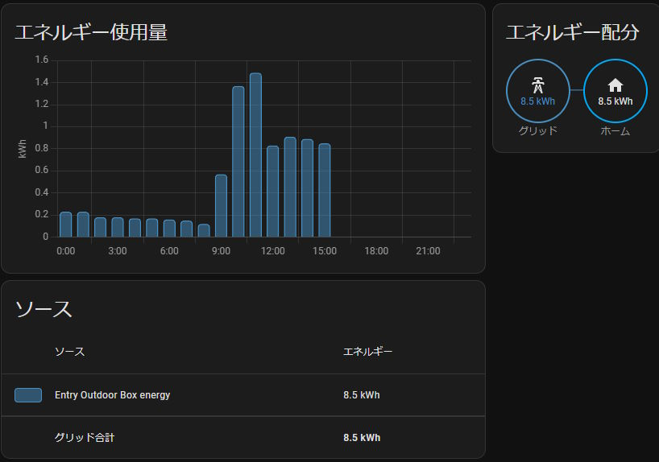

# esphome-broute: [ESPHome](https://esphome.io/)用スマートメーターコンポーネント

スマート電力メーターからBルート経由で瞬時電力値と積算電力量を取得します。

# 必要なもの

* [ESPHome](https://esphome.io/)が動作するマイコン(ESP32シリーズ等)
* [SKSTACK IP for HAN](https://www.skyley.com/wiki/?SKSTACK+IP+for+HAN)、Bルート対応でマイコンにUART接続可能なWi-SUNモジュール(Rohm社 BP35A1+BP35A7Aで動作確認)

# ESPHome への本コンポーネントの導入

設定ファイルに以下のように外部コンポーネントを指定してください。`name:`や`friendly_name:`は適宜。

```yaml
esphome:
  name: example
  friendly_name: B Route Meter
  platformio_options:
    build_flags:
    - -std=gnu++17 -Wall -Wextra
    build_unflags:
    - -std=gnu++11
external_components:
- source: github://homy-newfs8/esphome-broute@v0.1.1
  components: [ b_route ]

esp32:
  board: firebeetle32
  framework:
    type: arduino
```

`esp32:`以降は使用するマイコンや好みに合わせて設定してください。

# esphome-brouteの設定

Wi-SUNモジュールが接続されているUARTポート、スマートメーターに設定されたIDやパスワード、データの取得間隔等を設定します。

```yaml
uart:
  baud_rate: 115200
  rx_pin: 25
  tx_pin: 26
  # debug:
  #   sequence:
  #     - lambda: UARTDebug::log_string(direction, bytes);

b_route:
  rbid: !secret rb_id
  password: !secret rb_password
  power:
    name: power
    update_interval: 20s
    force_update: true
  energy:
    name: energy
    update_interval: 60s
    force_update: true
```

(上記`uart:`設定中`debug:`部分のコメントを外すとESPHomeのログにWi-SUNモジュールとの通信内容が出力されます)

1つのマイコン上で複数のUART接続デバイスを利用する場合は以下のように、`id:`と`uart_id:`を使って組合せを指定してください。

```yaml
uart:
- id: uart_1
  baud_rate: 115200
  :
- id: uart_2
  :
  :

b_route:
  uart_id: uart_2
  :
  :
```
## 設定値

* **rbid** (**必須**, 文字列): Bルート認証ID。32文字文字列
* **password** (**必須**, 文字列): Bルート認証パスワード
* **uart_id** (*任意*): 複数のUARTが存在する場合に、対象となるモジュールが接続されているUARTを指定する
* **rejoin_count** (*任意*, 0～127): 設定した回数連続でデータ取得に失敗した場合、再接続を実行する。0を指定すると発動しない。初期値: 10
* **rejoin_timeout** (*任意*, 時間): 設定した時間データ取得できていない場合、再接続を実行する。0を指定すると発動しない。初期値: 120s
* **rescan_timeout** (*任意*, 時間): 指定した時間データ取得できていない場合、再スキャン後に再接続する。0を指定すると発動しない。初期値: 240s
* **restart_timeout** (*任意*, 時間): 指定した時間データ取得できていない場合、マイコンを再起動する。0を指定すると発動しない。初期値: 360s

### 計測値の出力設定

* **power** (*任意*, [センサー](https://esphome.io/components/sensor/#config-sensor)) 瞬時電力計測値(W)
  * **update_interval** (*任意*, 時間): データ更新間隔。初期値: 30s
  * その他 [センサー](https://esphome.io/components/sensor/#config-sensor) の設定項目
* **energy** (*任意*, [センサー](https://esphome.io/components/sensor/#config-sensor)) 積算電力量計測値(kWh)
  * **update_interval** (*任意*, 時間): データ更新間隔。初期値: 60s
  * その他 [センサー](https://esphome.io/components/sensor/#config-sensor) の設定項目

## 設定サンプル

[example.yaml](../example.yaml)を参照願います。

# 動作例

設定が完了したESPHomeを[HomeAssistant](https://www.home-assistant.io/)と接続すると以下のような表示が可能です。

